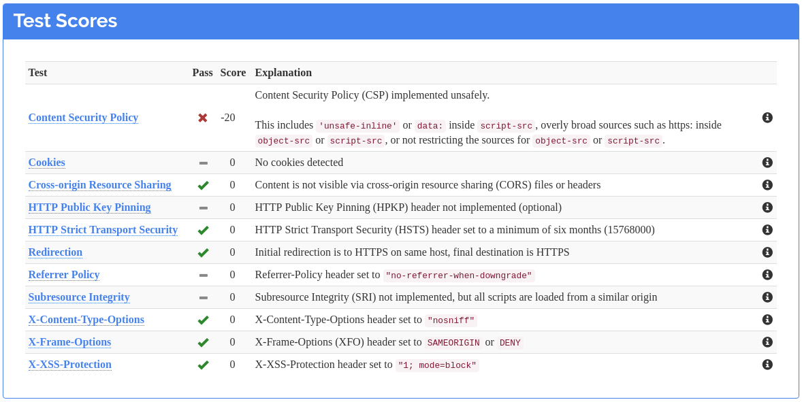
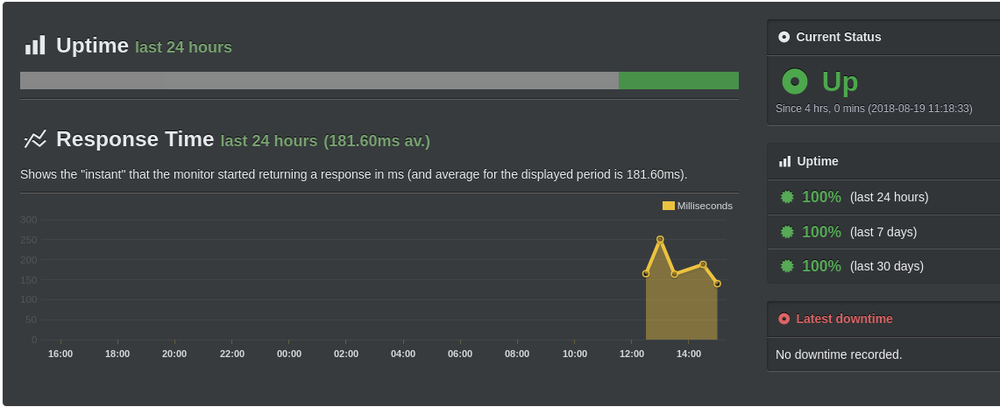

Every company needs a website, and Tempered Works is no exception!
Having bought the domain names when I set the company up, I've been putting off getting a website up and running because I'm not really a front-end creative type.
When I heard [Jason Lengstorf](https://twitter.com/jlengstorf) talking to [The Changelog](https://changelog.com/podcast/306) about [GatsbyJS](https://www.gatsbyjs.org/),
I was intrigued... so I tried it out.

## Why GatsbyJS?

I think [GatsbyJS](https://www.gatsbyjs.org/) is interesting when compared to other static site generators because it's based on GraphQL and React.
I've never worked with React, so there's an opportunity to learn about that, but I think the GraphQL part is most interesting.
The idea is that you can generate content on your site based on queries to other datasources.
The queries are done at build time, so you still get a static site, with the associated benefits.
Benefits like fewer security considerations (although there are still some - we'll get back to that),
many options for cheap or free hosting, great reliability and the potential for super-fast page load times.

## Where to Start?

Gatsby provides loads of "[starters](https://www.gatsbyjs.org/docs/gatsby-starters/)", projects you can use as a basis for your own.
A quick look down the list and I settled for [gatsby-starter-lumen](https://github.com/alxshelepenok/gatsby-starter-lumen).
I felt it had a clean, professional look, and it seemed really quick on page loads.
A quick `gatsby new my-blog https://github.com/alxshelepenok/gatsby-starter-lumen` later, and I had a basic project.
If you're trying it out for yourself, check out the [Gatsby docs](https://www.gatsbyjs.org/docs/) to fill in the details I leave out.

I'm not sure whether I'll stick with the theme.
Aside from the clean styling, it's the blog aspect and markdown support for posts that I like.
After adding a couple of links and a company footer to the sidebar, the mobile view is mostly links and footer!
It also feels unnecessarily narrow on my laptop, so code snippets are particular hard to use without scrollbars.
We'll see, hopefully it wouldn't be too difficult to switch if I decided to.

## Where does GraphQL fit?

After creating a dummy blog post and `gatsby develop`-ing my site up on `localhost:8000`,
I decided to add social links for [linkedin](https://linkedin.com) and [stackoverflow](https://stackoverflow.com).
Each component and each page looks up the data it needs with a GraphQL query.
Where were the social links coming from?

The social links appear in the sidebar on every page,
so the details are kept in the [gatsby-config.js](https://github.com/alxshelepenok/gatsby-starter-lumen/blob/2a6e053ab9d3e8f9f3d2e6b511436f8c8e727f6e/gatsby-config.js) file,
under `siteMetadata > author`.
This config file is available to query, and each page does exactly that.
For example, the index page uses [this query](https://github.com/alxshelepenok/gatsby-starter-lumen/blob/2a6e053ab9d3e8f9f3d2e6b511436f8c8e727f6e/src/pages/index.jsx#L34).
These pieces of data are then rendered in the [Links](https://github.com/alxshelepenok/gatsby-starter-lumen/blob/2a6e053ab9d3e8f9f3d2e6b511436f8c8e727f6e/src/components/Links/index.jsx#L18)
component, which is used in the Sidebar component, which is itself used in almost every page.

So - to add these links, I need to:
- add the details for my new social links to `gatsby-config.js`,
- update the queries to fetch those new links,
- update the `Links` component to render the new links.

Unfortunately, I need to update the query to include the new links on *every* page that uses the sidebar!
That got tedious fast, but Gatsby and GraphQL have a solution - fragments.
After defining a query fragment to fetch the author details,
I swapped the fragment into every query that used the author details.
Adding or removing author details can now be done in one place.
[Gatsby's GraphQL document](https://www.gatsbyjs.org/docs/querying-with-graphql/) is a must-read!

## Why Host when you can Netlify!

[Netlify](https://netlify.com) was the obvious choice to host this site.
It's free for a simple, single-user site like this and it knows how to deploy a Gatsby site.
All I had to do was authorise access to my Github account, select the repository I wanted to deploy and wait a few seconds
for the site served on a https:// URL with a randomly generated host to build and deploy.
That leads us neatly to security and performance!

## What About Security?

Even though this is a static site, there are still ways it could be abused.
We don't have the traditional backend attack vectors because we don't have a server or a database.
Bad actors could still get creative with JavaScript, iframes, and so on to compromise *your* computer or influence what you're seeing on this site.
I used [Mozilla's Observatory](https://observatory.mozilla.org) to scan the site that Netlify launched for me, and it got a D+ rating.
Could be worse, I guess, but that's not good enough!

It's possible to influence the headers that Netlify serves.
To keep things tidy, there's [gatsby-plugin-netlify](https://www.gatsbyjs.org/packages/gatsby-plugin-netlify/), a Gatsby plugin that can make the header configuration part of your Gatsby configuration.
I started by adding the headers that Observatory recommended, to get an A+ rating.
Then I relaxed the rules until the site worked again!

I like that approach, particularly when I'm using an open source project like Gatsby and the Lumen theme,
because you essentially get a guided tour of what the site is doing that has security implications.
I also caught a mistake because of these headers.
I'd left a [Giphy](https://giphy.com) link to an image instead of using the site's local copy.
The CSP headers disallowed it because they only allow images to be served from 'self' and Google Analytics.

It took  about 10 commits before I was happy-ish with the headers and the site was working without any errors in the JavaScript console.
The site gets a B+ right now, with the remaining issues being Content Security Policy specifications that are a little more lenient than we'd ideally like.
It looks like the Gatsby team is [working on dealing with those remaining issues](https://github.com/gatsbyjs/gatsby/issues/3758).

The CSP headers I ended up with were quite verbose, and Gatsby's config file is JS, so I added a bit of code to make things a little more maintainable.

```javascript
const cspDirectives = [
  "default-src 'self'",
  "script-src 'self' 'unsafe-inline' https://www.google-analytics.com",
  "font-src 'self' https://fonts.googleapis.com https://fonts.gstatic.com",
  "style-src 'self' 'unsafe-inline' https://fonts.googleapis.com",
  "img-src 'self' https://www.google-analytics.com"
];

const directivesToCspHeader = headers => headers.join(';');
```

I can now use these in the config like this:

```javascript
{
  resolve: 'gatsby-plugin-netlify',
  options: {
    headers: {
      '/*': [
        'X-Frame-Options: DENY',
        'X-XSS-Protection: 1; mode=block',
        'X-Content-Type-Options: nosniff',
        `Content-Security-Policy: ${directivesToCspHeader(cspDirectives)}`,
        'Referrer-Policy: no-referrer-when-downgrade'
      ]
    }
  }
}
```

Here's the observatory's advice on those headers.




## What about Performance?

A similar approach to benchmark performance, using Google's [Page Speed](https://developers.google.com/speed/pagespeed/insights/) tool.
Right now, we're getting 71% on the mobile optimisation benchmark, and 90% on the desktop benchmark.
Whilst the site feels very snappy to me, there's probably work to do there when I have time, but at least I have a measurement to start from.


## Monitoring

The last thing to touch on is the boring operations stuff.
How will I know if the site goes down or goes slow, particularly as I don't have any servers to alert me?
My go-to tool for this kind of thing was [Pingdom](https://pingdom.com), but it looks like they've done away with their free tier.
If I recall correctly, it used to be free to healthcheck two URls. Now you get a 14 day trial.

We can't really complain when previously free services change their terms, but before signing up I checked whether anyone else was doing this basic health checking,
and I found [UptimeRobot](https://uptimerobot.com). They have a generous free tier, so I signed up there instead and pointed them at the test site.
It's been checking for three hours now and everything looks good.
I can also see that the response times are between 150-250ms, which is a useful measure to have historical data on!



## Finally... DNS and TLS Setup

The last thing to do is migrate the DNS records over to Netlify, so that https://tempered.works points to the Netlify site!
I bought the domain though [Hover](https://www.hover.com) after recommendations by [Steve Gibson](https://twitter.com/sggrc) on the [Security Now!](https://twit.tv/shows/security-now) podcast.
Hover is fine, but they don't support CNAME flattening, ANAME or ALIAS records that are required by Netlify to get the full benefits of an apex domain.
`tempered.works` is an apex domain, `www.tempered.works` would be a non-apex alternative. I want `tempered.works` to be my domain!.
I could move my DNS to Netlify but I'm trying just pointing A records to Netlify's load balancer for now.
You may want to choose a DNS provider that supports those newer record types if you intend to host on cloud services!

Of course, now I'm using my own domain name I need a TLS certificate that matches.
Netlify's got me covered - it automatically provisioned me a free [Let's Encrypt!](https://letsencrypt.org/) certificate for my domain.
It took over half an hour, but that's no problem.
Once the certificate was provisioned, I got the option of forcing connections to `https://`, so I turned it on.
Why would you want to access this site over plaintext anyway?

That's it - tempered.works is online!

## Credits

- Under construction gif courtesy of https://giphy.com/stickers/please-construction-patient-JIejyxfnKRVv2
