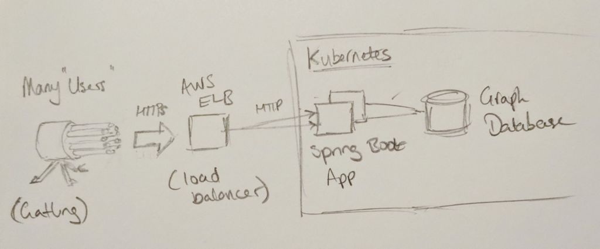

Just after the rest of the team had left for their Christmas holidays, my colleague and I discovered a weird performance problem with a Spring Boot application we'd just started writing.
This is a the story of discovering the problem and the detective work that led us to the culprit hiding in plain sight.
We're going to recreate the app and the performance tests, but first I'll tell you how we got here.

## Prologue

Twenty requests per second.
Any more than that and response times would climb.
Eventually, the load balancer's readiness checks would timeout and it'd refuse to send traffic to the app, taking the service offline.

Here's what our little prototype system looked like:



We're building an API, rather than a website. 
Clients authenticate by passing a username and password in the request.
Each request is a query, and the app talks to a graph database to calculate an answer, returning it as a JSON document.
It's running in a Kubernetes cluster on AWS, behind an Elastic Load Balancer.

How can it be struggling to serve more than twenty requests per second?
I've not used this graph database before, can it really be that slow? Nor have I used Kubernetes or Spring Boot, are they responsible? You wouldn't think there'd be enough of our code yet to perform so poorly, but our own code is always the go-to suspect.

## Too Many Suspects

There's too many potential culprits here, so let's eliminate some. Can I reproduce the problem here on my machine? Yes - and I get a clue. As the test runs, I can hear the fan spinning up. Checking back on AWS for server metrics, the CPU utilisation was shooting up to 100% during the test. That removes Kubernetes, the load balancer, the network and disks from the investigation, at least for now. Memory could still be a problem, as Java's garbage collection chews up compute time when there's not enough memory.

Now we eliminate the database. We'd written a resource to return version information, which is just returning a document from memory. Running the performance test on that endpoint revealed the same terrible performance! Something to do with the Spring framework, or the Tomcat application server then - where can we go from here?

We *could* pull out profiler tooling to look inside the running app and see what's going on. It's been a while since I used that tooling on the JVM, and it'll produce a lot information to interpret, so I'll leave that as a backup plan. For now, we've got an easy option that will rule out the Spring Boot framework and Tomcat application server. A "getting started" Spring Boot app won't take long to set up. We can eliminate JSON processing, configuration problems and coding errors as potential candidates, and get a benchmark for how performant the simplest Spring Boot app is with our hardware and test setup.

This is where we write some code.

## The "Getting Started" App

You can find and clone the project we're talking about in this post on Github at https://github.com/brabster/performance-with-spring-boot/tree/1.0. You'll need a JDK and Maven installed to compile and run the application.

I based the "getting started" app closely on [Spring Boot's documentation](https://spring.io/guides/gs/spring-boot/). It's got one endpoint at `/` and returns a JSON document `{"greeting": "Greetings from Spring Boot!"}` like [this](https://github.com/brabster/performance-with-spring-boot/blob/1.0/src/main/java/hello/HelloController.java):

```java
package hello;

import org.springframework.web.bind.annotation.RestController;
import org.springframework.web.bind.annotation.RequestMapping;

@RestController
public class HelloController {

    class Greeting {
        public String getGreeting() {
            return "Greetings from Spring Boot!";
        }
    }

    @RequestMapping("/")
    public Greeting index() {
        return new Greeting();
    }

}
```

We'll use Spring Security to authenticate API clients, so we need to add the dependencies and set a default username and password. The dependencies we need to add to our Maven [pom.xml](https://github.com/brabster/performance-with-spring-boot/blob/1.0/pom.xml) file are:

```xml
<dependency>
    <groupId>org.springframework.security</groupId>
    <artifactId>spring-security-web</artifactId>
    <version>5.1.2.RELEASE</version>
</dependency>
<dependency>
    <groupId>org.springframework.security</groupId>
    <artifactId>spring-security-config</artifactId>
    <version>5.1.2.RELEASE</version>
</dependency>
```

To set a default username and password, we add a [properties file](https://github.com/brabster/performance-with-spring-boot/blob/1.0/src/main/resources/application.properties) containing two properties that override Spring Security's defaults:

```
spring.security.user.name=user
spring.security.user.password=24gh39ugh0
```

Start the app with `mvn spring-boot:run` and you should see something like this:


## Performance Testing with Gatling

[Gatling](https://gatling.io/) is the tooling that gave us those original requests per second figures, so let's reproduce the setup to do our performance tests here. Gatling tests are written in Scala and can coexist with the Java code, but we need a little support in our project to run tests and get editor support for Scala.

To compile Scala code and enable Scala support (at least in [IntelliJ IDEA](https://www.jetbrains.com/idea/)) I used the rather neat [scala-maven-plugin](https://davidb.github.io/scala-maven-plugin/index.html):

```xml
<plugin>
    <groupId>net.alchim31.maven</groupId>
    <artifactId>scala-maven-plugin</artifactId>
    <version>3.4.4</version>
    <executions>
        <execution>
            <id>scala-test-compile</id>
            <phase>process-test-resources</phase>
            <goals>
                <goal>testCompile</goal>
            </goals>
        </execution>
    </executions>
</plugin>
```

To run Gatling from Maven and view its output, we need a dependency and a plugin:

```xml
<dependency>
    <groupId>io.gatling.highcharts</groupId>
    <artifactId>gatling-charts-highcharts</artifactId>
    <scope>test</scope>
    <version>3.0.2</version>
</dependency>
```

```xml
<plugin>
    <groupId>io.gatling</groupId>
    <artifactId>gatling-maven-plugin</artifactId>
    <version>3.0.1</version>
</plugin>
```

Now we can write a Gatling test. This is our scenario, describing the client behaviour we want to test.

```scala
setUp(myScenario.inject(
    incrementUsersPerSec(20)
      .times(5)
      .eachLevelLasting(5 seconds)
      .startingFrom(20)
  )).protocols(httpProtocol)
    .assertions(global.successfulRequests.percent.is(100))
```

We're starting with 20 users per second making a request to the `/` resource, holding at that concurrency for five seconds. They only make one request. Then we increase the number of users per second by twenty, five times, holding for five seconds each time. Every request must return an HTTP 200 status code to pass the test. Simple! You'll find the rest of the test in [LoadTest.scala](https://github.com/brabster/performance-with-spring-boot/blob/1.0/src/test/scala/hello/LoadTest.scala).

Make sure the app is running and then run the test with `mvn gatling:test`.


When the tests run you see a progress bar being refreshed every few seconds. The `###` part represents the proportion of requests that have been made and completed. The section with dashes `---` is requests made but not yet completed. The numbers are just below the progress bar, `active` telling us how many requests have been made but not yet completed. There's a lot of those, over a thousand towards the end of the test, and this computer isn't exactly underpowered. There's our performance problem! Towards the end of the test, requests are taking over 26 seconds to complete.

If you cloned the project, you can try changing the scenario in [LoadTest.scala](https://github.com/brabster/performance-with-spring-boot/blob/1.0/src/test/scala/hello/LoadTest.scala) to explore the problem. Running something like `top` will show you your live CPU utilisation. I can see the app using almost a full 4 cores while the test is running. To serve a short text string from memory to less than 100 users per second!

## Gatling's Reports

Gatling saves a report of metrics and charts for each test. There's a couple that I think give us interesting insight into what just happened that we might not have seen as the test was running.


The "Response Time Distribution" report tells us that the fastest few requests are served in around 200ms. So it takes at least 200ms to serve a request! Then there's an roughly uniform distribution of request times up to 30 seconds. The test only ran for around 70 seconds in total.

Next, the "Number of requests per second" chart shows more clearly that the app isn't keeping up, even with these low request rates. The number of active users (those that have made a request and not yet had a response) climbs until Gatling stops sending new requests.


You can see the app is not quite able to keep up at 40 requests per second. as we ramp to 60 the line swings upwards as it really starts to fall behind. 45 seconds or so into the test the number of requests per second drops from 100 to zero, and the number of active requests, just over 1000 by this point, stops climbing and starts to fall as the app starts to clear its backlog.

Gatling's reports show you plenty of other interesting charts and figures. Find them in your `target` directory after running a test.

## Next Time

That's the context, the tools and a simple codebase to get us started. In [Part 2](/posts/2019-01-17-spring-boot-performance-part-2), we see how a performance problem shows itself and figure out how to resolve it.
